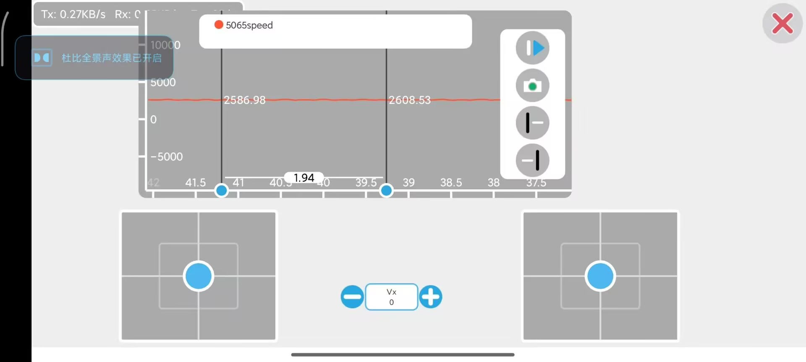

# 项目名称：MT6701测速N5065
## 一、硬件使用
- 开发板：STM32F103C8T6最小系统板
- 编码器：MT6701绝对值编码器
- 电子调速器：好盈铂金款120A无刷电机控制电调
- 
## 二、环境搭建
- 软件环境：keil MDK5/ VScode MDK6
  
## 三、作者信息
- 姓名：房梓豪
- 团队：山东理工大学Vinci机器人战队
- 时间：2025年4月27日
- github：https://github.com/Lucas-Fang/stm32-code.git
- 邮箱：luckpark20@gmail.com
  
## 四、演示
